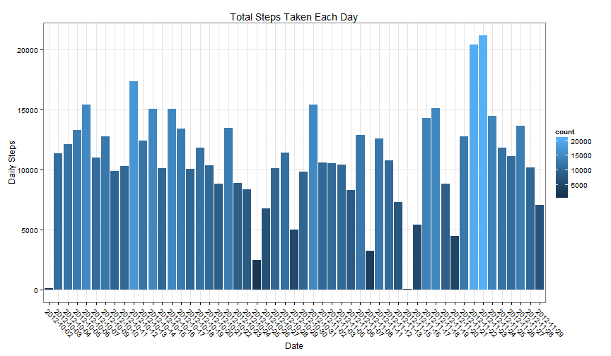
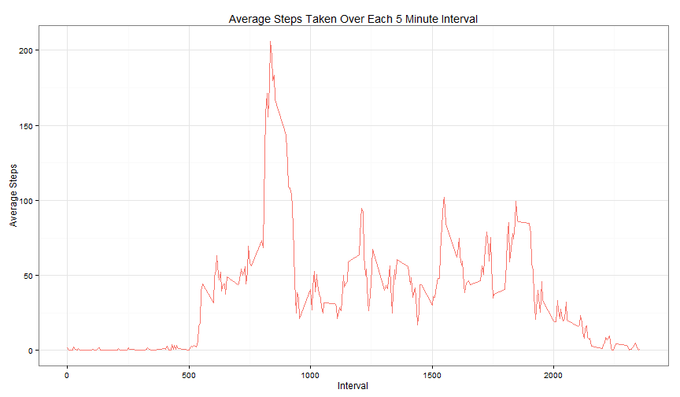
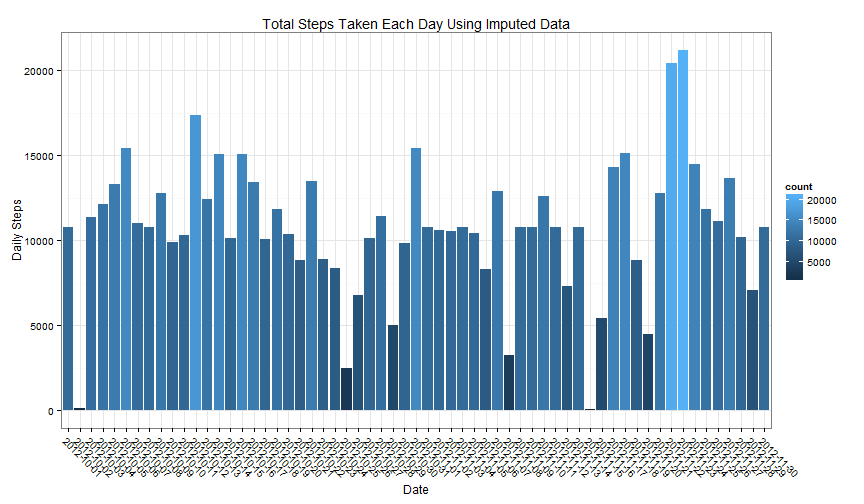
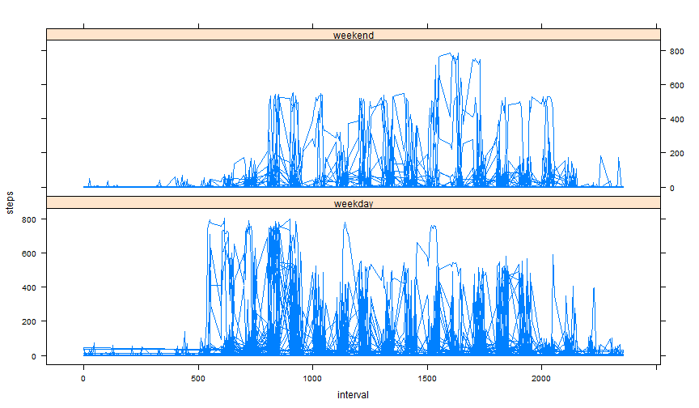
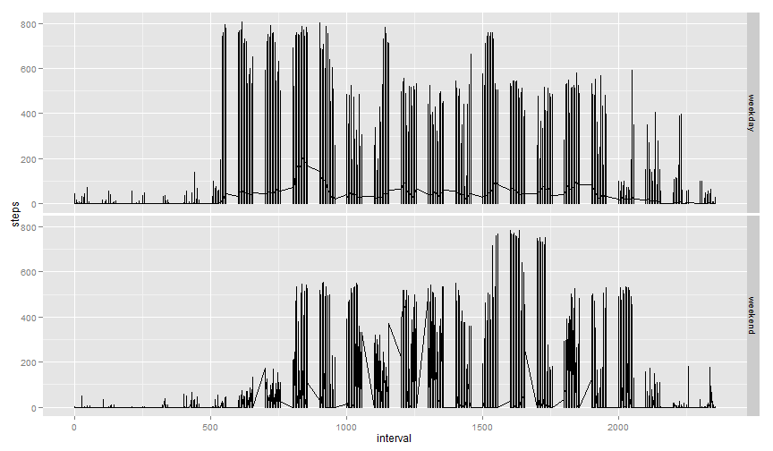
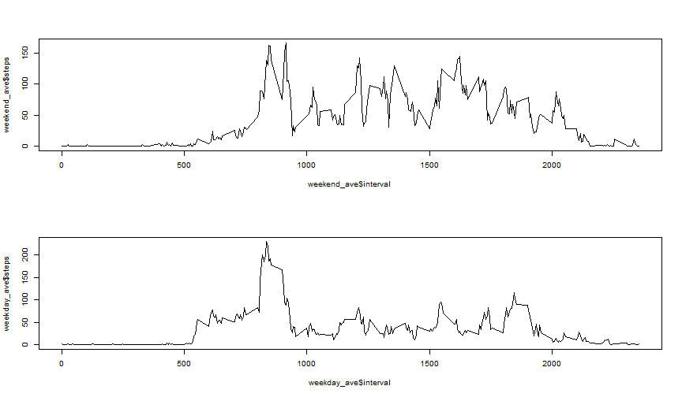

Reproducible Research Assignment #1
===================================

Purpose: This assignment analyzes anonymous data from an activity monitoring device and computes various results including the mean and median of steps taken and provides several graphs of the data to help in understanding the behaviour.

## Initialization

Set up the working directory where the data file is located


```r
setwd("c:/dev/coursera-r/ReproducibleResearch")
```

## Loading And Preprocessing The Data

The data is stored in a CSV file and the following code is used to load the data and store it in a data frame for further processing.If the data is NA, then replace it with 0.


```r
activity <- read.csv("activity.csv")
```

## Histogram Of Steps Taken Each Day

Compute the number of steps for each day where data is available and create the histogram using ggplot2


```r
library(ggplot2)
daily_steps <- aggregate(steps ~ date,activity,sum)

ggplot(daily_steps,aes(date)) + geom_histogram(aes(weight=steps,fill= ..count..),binwidth=1) + theme_bw() + xlab("Date") + ylab("Daily Steps") + ggtitle("Total Steps Taken Each Day") + theme(axis.text.x=element_text(angle = -45, hjust = 0))  
```

 

## Mean and Median Of Steps Taken Each Day


```r
daily_mean   <- aggregate(steps ~ date, activity, mean)
daily_median <- aggregate(steps ~ date, activity, median)
```

Include the xtable package and then generate html style tables


```r
library(xtable)
table_mean <- xtable(daily_mean)
table_median <- xtable(daily_median)
```

### Mean steps taken daily


```r
print(table_mean,type="html")
```

<!-- html table generated in R 3.1.0 by xtable 1.7-3 package -->
<!-- Sat Jul 19 10:51:44 2014 -->
<TABLE border=1>
<TR> <TH>  </TH> <TH> date </TH> <TH> steps </TH>  </TR>
  <TR> <TD align="right"> 1 </TD> <TD> 2012-10-02 </TD> <TD align="right"> 0.44 </TD> </TR>
  <TR> <TD align="right"> 2 </TD> <TD> 2012-10-03 </TD> <TD align="right"> 39.42 </TD> </TR>
  <TR> <TD align="right"> 3 </TD> <TD> 2012-10-04 </TD> <TD align="right"> 42.07 </TD> </TR>
  <TR> <TD align="right"> 4 </TD> <TD> 2012-10-05 </TD> <TD align="right"> 46.16 </TD> </TR>
  <TR> <TD align="right"> 5 </TD> <TD> 2012-10-06 </TD> <TD align="right"> 53.54 </TD> </TR>
  <TR> <TD align="right"> 6 </TD> <TD> 2012-10-07 </TD> <TD align="right"> 38.25 </TD> </TR>
  <TR> <TD align="right"> 7 </TD> <TD> 2012-10-09 </TD> <TD align="right"> 44.48 </TD> </TR>
  <TR> <TD align="right"> 8 </TD> <TD> 2012-10-10 </TD> <TD align="right"> 34.38 </TD> </TR>
  <TR> <TD align="right"> 9 </TD> <TD> 2012-10-11 </TD> <TD align="right"> 35.78 </TD> </TR>
  <TR> <TD align="right"> 10 </TD> <TD> 2012-10-12 </TD> <TD align="right"> 60.35 </TD> </TR>
  <TR> <TD align="right"> 11 </TD> <TD> 2012-10-13 </TD> <TD align="right"> 43.15 </TD> </TR>
  <TR> <TD align="right"> 12 </TD> <TD> 2012-10-14 </TD> <TD align="right"> 52.42 </TD> </TR>
  <TR> <TD align="right"> 13 </TD> <TD> 2012-10-15 </TD> <TD align="right"> 35.20 </TD> </TR>
  <TR> <TD align="right"> 14 </TD> <TD> 2012-10-16 </TD> <TD align="right"> 52.38 </TD> </TR>
  <TR> <TD align="right"> 15 </TD> <TD> 2012-10-17 </TD> <TD align="right"> 46.71 </TD> </TR>
  <TR> <TD align="right"> 16 </TD> <TD> 2012-10-18 </TD> <TD align="right"> 34.92 </TD> </TR>
  <TR> <TD align="right"> 17 </TD> <TD> 2012-10-19 </TD> <TD align="right"> 41.07 </TD> </TR>
  <TR> <TD align="right"> 18 </TD> <TD> 2012-10-20 </TD> <TD align="right"> 36.09 </TD> </TR>
  <TR> <TD align="right"> 19 </TD> <TD> 2012-10-21 </TD> <TD align="right"> 30.63 </TD> </TR>
  <TR> <TD align="right"> 20 </TD> <TD> 2012-10-22 </TD> <TD align="right"> 46.74 </TD> </TR>
  <TR> <TD align="right"> 21 </TD> <TD> 2012-10-23 </TD> <TD align="right"> 30.97 </TD> </TR>
  <TR> <TD align="right"> 22 </TD> <TD> 2012-10-24 </TD> <TD align="right"> 29.01 </TD> </TR>
  <TR> <TD align="right"> 23 </TD> <TD> 2012-10-25 </TD> <TD align="right"> 8.65 </TD> </TR>
  <TR> <TD align="right"> 24 </TD> <TD> 2012-10-26 </TD> <TD align="right"> 23.53 </TD> </TR>
  <TR> <TD align="right"> 25 </TD> <TD> 2012-10-27 </TD> <TD align="right"> 35.14 </TD> </TR>
  <TR> <TD align="right"> 26 </TD> <TD> 2012-10-28 </TD> <TD align="right"> 39.78 </TD> </TR>
  <TR> <TD align="right"> 27 </TD> <TD> 2012-10-29 </TD> <TD align="right"> 17.42 </TD> </TR>
  <TR> <TD align="right"> 28 </TD> <TD> 2012-10-30 </TD> <TD align="right"> 34.09 </TD> </TR>
  <TR> <TD align="right"> 29 </TD> <TD> 2012-10-31 </TD> <TD align="right"> 53.52 </TD> </TR>
  <TR> <TD align="right"> 30 </TD> <TD> 2012-11-02 </TD> <TD align="right"> 36.81 </TD> </TR>
  <TR> <TD align="right"> 31 </TD> <TD> 2012-11-03 </TD> <TD align="right"> 36.70 </TD> </TR>
  <TR> <TD align="right"> 32 </TD> <TD> 2012-11-05 </TD> <TD align="right"> 36.25 </TD> </TR>
  <TR> <TD align="right"> 33 </TD> <TD> 2012-11-06 </TD> <TD align="right"> 28.94 </TD> </TR>
  <TR> <TD align="right"> 34 </TD> <TD> 2012-11-07 </TD> <TD align="right"> 44.73 </TD> </TR>
  <TR> <TD align="right"> 35 </TD> <TD> 2012-11-08 </TD> <TD align="right"> 11.18 </TD> </TR>
  <TR> <TD align="right"> 36 </TD> <TD> 2012-11-11 </TD> <TD align="right"> 43.78 </TD> </TR>
  <TR> <TD align="right"> 37 </TD> <TD> 2012-11-12 </TD> <TD align="right"> 37.38 </TD> </TR>
  <TR> <TD align="right"> 38 </TD> <TD> 2012-11-13 </TD> <TD align="right"> 25.47 </TD> </TR>
  <TR> <TD align="right"> 39 </TD> <TD> 2012-11-15 </TD> <TD align="right"> 0.14 </TD> </TR>
  <TR> <TD align="right"> 40 </TD> <TD> 2012-11-16 </TD> <TD align="right"> 18.89 </TD> </TR>
  <TR> <TD align="right"> 41 </TD> <TD> 2012-11-17 </TD> <TD align="right"> 49.79 </TD> </TR>
  <TR> <TD align="right"> 42 </TD> <TD> 2012-11-18 </TD> <TD align="right"> 52.47 </TD> </TR>
  <TR> <TD align="right"> 43 </TD> <TD> 2012-11-19 </TD> <TD align="right"> 30.70 </TD> </TR>
  <TR> <TD align="right"> 44 </TD> <TD> 2012-11-20 </TD> <TD align="right"> 15.53 </TD> </TR>
  <TR> <TD align="right"> 45 </TD> <TD> 2012-11-21 </TD> <TD align="right"> 44.40 </TD> </TR>
  <TR> <TD align="right"> 46 </TD> <TD> 2012-11-22 </TD> <TD align="right"> 70.93 </TD> </TR>
  <TR> <TD align="right"> 47 </TD> <TD> 2012-11-23 </TD> <TD align="right"> 73.59 </TD> </TR>
  <TR> <TD align="right"> 48 </TD> <TD> 2012-11-24 </TD> <TD align="right"> 50.27 </TD> </TR>
  <TR> <TD align="right"> 49 </TD> <TD> 2012-11-25 </TD> <TD align="right"> 41.09 </TD> </TR>
  <TR> <TD align="right"> 50 </TD> <TD> 2012-11-26 </TD> <TD align="right"> 38.76 </TD> </TR>
  <TR> <TD align="right"> 51 </TD> <TD> 2012-11-27 </TD> <TD align="right"> 47.38 </TD> </TR>
  <TR> <TD align="right"> 52 </TD> <TD> 2012-11-28 </TD> <TD align="right"> 35.36 </TD> </TR>
  <TR> <TD align="right"> 53 </TD> <TD> 2012-11-29 </TD> <TD align="right"> 24.47 </TD> </TR>
   </TABLE>

### Median steps taken daily


```r
print(table_median,type="html")
```

<!-- html table generated in R 3.1.0 by xtable 1.7-3 package -->
<!-- Sat Jul 19 10:51:44 2014 -->
<TABLE border=1>
<TR> <TH>  </TH> <TH> date </TH> <TH> steps </TH>  </TR>
  <TR> <TD align="right"> 1 </TD> <TD> 2012-10-02 </TD> <TD align="right"> 0.00 </TD> </TR>
  <TR> <TD align="right"> 2 </TD> <TD> 2012-10-03 </TD> <TD align="right"> 0.00 </TD> </TR>
  <TR> <TD align="right"> 3 </TD> <TD> 2012-10-04 </TD> <TD align="right"> 0.00 </TD> </TR>
  <TR> <TD align="right"> 4 </TD> <TD> 2012-10-05 </TD> <TD align="right"> 0.00 </TD> </TR>
  <TR> <TD align="right"> 5 </TD> <TD> 2012-10-06 </TD> <TD align="right"> 0.00 </TD> </TR>
  <TR> <TD align="right"> 6 </TD> <TD> 2012-10-07 </TD> <TD align="right"> 0.00 </TD> </TR>
  <TR> <TD align="right"> 7 </TD> <TD> 2012-10-09 </TD> <TD align="right"> 0.00 </TD> </TR>
  <TR> <TD align="right"> 8 </TD> <TD> 2012-10-10 </TD> <TD align="right"> 0.00 </TD> </TR>
  <TR> <TD align="right"> 9 </TD> <TD> 2012-10-11 </TD> <TD align="right"> 0.00 </TD> </TR>
  <TR> <TD align="right"> 10 </TD> <TD> 2012-10-12 </TD> <TD align="right"> 0.00 </TD> </TR>
  <TR> <TD align="right"> 11 </TD> <TD> 2012-10-13 </TD> <TD align="right"> 0.00 </TD> </TR>
  <TR> <TD align="right"> 12 </TD> <TD> 2012-10-14 </TD> <TD align="right"> 0.00 </TD> </TR>
  <TR> <TD align="right"> 13 </TD> <TD> 2012-10-15 </TD> <TD align="right"> 0.00 </TD> </TR>
  <TR> <TD align="right"> 14 </TD> <TD> 2012-10-16 </TD> <TD align="right"> 0.00 </TD> </TR>
  <TR> <TD align="right"> 15 </TD> <TD> 2012-10-17 </TD> <TD align="right"> 0.00 </TD> </TR>
  <TR> <TD align="right"> 16 </TD> <TD> 2012-10-18 </TD> <TD align="right"> 0.00 </TD> </TR>
  <TR> <TD align="right"> 17 </TD> <TD> 2012-10-19 </TD> <TD align="right"> 0.00 </TD> </TR>
  <TR> <TD align="right"> 18 </TD> <TD> 2012-10-20 </TD> <TD align="right"> 0.00 </TD> </TR>
  <TR> <TD align="right"> 19 </TD> <TD> 2012-10-21 </TD> <TD align="right"> 0.00 </TD> </TR>
  <TR> <TD align="right"> 20 </TD> <TD> 2012-10-22 </TD> <TD align="right"> 0.00 </TD> </TR>
  <TR> <TD align="right"> 21 </TD> <TD> 2012-10-23 </TD> <TD align="right"> 0.00 </TD> </TR>
  <TR> <TD align="right"> 22 </TD> <TD> 2012-10-24 </TD> <TD align="right"> 0.00 </TD> </TR>
  <TR> <TD align="right"> 23 </TD> <TD> 2012-10-25 </TD> <TD align="right"> 0.00 </TD> </TR>
  <TR> <TD align="right"> 24 </TD> <TD> 2012-10-26 </TD> <TD align="right"> 0.00 </TD> </TR>
  <TR> <TD align="right"> 25 </TD> <TD> 2012-10-27 </TD> <TD align="right"> 0.00 </TD> </TR>
  <TR> <TD align="right"> 26 </TD> <TD> 2012-10-28 </TD> <TD align="right"> 0.00 </TD> </TR>
  <TR> <TD align="right"> 27 </TD> <TD> 2012-10-29 </TD> <TD align="right"> 0.00 </TD> </TR>
  <TR> <TD align="right"> 28 </TD> <TD> 2012-10-30 </TD> <TD align="right"> 0.00 </TD> </TR>
  <TR> <TD align="right"> 29 </TD> <TD> 2012-10-31 </TD> <TD align="right"> 0.00 </TD> </TR>
  <TR> <TD align="right"> 30 </TD> <TD> 2012-11-02 </TD> <TD align="right"> 0.00 </TD> </TR>
  <TR> <TD align="right"> 31 </TD> <TD> 2012-11-03 </TD> <TD align="right"> 0.00 </TD> </TR>
  <TR> <TD align="right"> 32 </TD> <TD> 2012-11-05 </TD> <TD align="right"> 0.00 </TD> </TR>
  <TR> <TD align="right"> 33 </TD> <TD> 2012-11-06 </TD> <TD align="right"> 0.00 </TD> </TR>
  <TR> <TD align="right"> 34 </TD> <TD> 2012-11-07 </TD> <TD align="right"> 0.00 </TD> </TR>
  <TR> <TD align="right"> 35 </TD> <TD> 2012-11-08 </TD> <TD align="right"> 0.00 </TD> </TR>
  <TR> <TD align="right"> 36 </TD> <TD> 2012-11-11 </TD> <TD align="right"> 0.00 </TD> </TR>
  <TR> <TD align="right"> 37 </TD> <TD> 2012-11-12 </TD> <TD align="right"> 0.00 </TD> </TR>
  <TR> <TD align="right"> 38 </TD> <TD> 2012-11-13 </TD> <TD align="right"> 0.00 </TD> </TR>
  <TR> <TD align="right"> 39 </TD> <TD> 2012-11-15 </TD> <TD align="right"> 0.00 </TD> </TR>
  <TR> <TD align="right"> 40 </TD> <TD> 2012-11-16 </TD> <TD align="right"> 0.00 </TD> </TR>
  <TR> <TD align="right"> 41 </TD> <TD> 2012-11-17 </TD> <TD align="right"> 0.00 </TD> </TR>
  <TR> <TD align="right"> 42 </TD> <TD> 2012-11-18 </TD> <TD align="right"> 0.00 </TD> </TR>
  <TR> <TD align="right"> 43 </TD> <TD> 2012-11-19 </TD> <TD align="right"> 0.00 </TD> </TR>
  <TR> <TD align="right"> 44 </TD> <TD> 2012-11-20 </TD> <TD align="right"> 0.00 </TD> </TR>
  <TR> <TD align="right"> 45 </TD> <TD> 2012-11-21 </TD> <TD align="right"> 0.00 </TD> </TR>
  <TR> <TD align="right"> 46 </TD> <TD> 2012-11-22 </TD> <TD align="right"> 0.00 </TD> </TR>
  <TR> <TD align="right"> 47 </TD> <TD> 2012-11-23 </TD> <TD align="right"> 0.00 </TD> </TR>
  <TR> <TD align="right"> 48 </TD> <TD> 2012-11-24 </TD> <TD align="right"> 0.00 </TD> </TR>
  <TR> <TD align="right"> 49 </TD> <TD> 2012-11-25 </TD> <TD align="right"> 0.00 </TD> </TR>
  <TR> <TD align="right"> 50 </TD> <TD> 2012-11-26 </TD> <TD align="right"> 0.00 </TD> </TR>
  <TR> <TD align="right"> 51 </TD> <TD> 2012-11-27 </TD> <TD align="right"> 0.00 </TD> </TR>
  <TR> <TD align="right"> 52 </TD> <TD> 2012-11-28 </TD> <TD align="right"> 0.00 </TD> </TR>
  <TR> <TD align="right"> 53 </TD> <TD> 2012-11-29 </TD> <TD align="right"> 0.00 </TD> </TR>
   </TABLE>

## Average Daily Activity Pattern

Compute the average number of steps taken in each 5 minute interval


```r
iave <- aggregate(steps ~ interval, activity, mean)
```

Create a time series plot of the average steps taken versus the interval


```r
ggplot(iave,aes(interval,steps)) + geom_line(aes(colour="blue")) + ylab("Average Steps") + xlab("Interval") + ggtitle("Average Steps Taken Over Each 5 Minute Interval") + theme_bw() + theme(legend.position="none")
```

 

### 5 Minute Interval With the Maximum Number Of Average Steps


```r
max_row <- which.max(iave$steps)
max_interval <- iave$interval[max_row]
max_steps <- iave$steps[max_row]
```

Maximum average steps of 206.1698 occurs at 835

## Imputing missing values

Compute the total number of missing values (NA)


```r
missing_values <- sum(is.na(activity$steps))
```

There are 2304 missing values in the data

We will set the missing values to the mean value for that interval and create a new data set


```r
imputed_activity <- activity
fn <- function(steps,interval) ifelse(is.na(steps),iave$steps[iave$interval==interval],steps)
imputed_activity$steps <- apply(activity[,c('steps','interval')],1,function(y) fn(y['steps'],y['interval']) )
```

## Histogram Of Steps Taken Each Day Based On Imputed Data

Compute the number of steps for each day from the imputed data and create the histogram


```r
imputed_steps <- aggregate(steps ~ date,imputed_activity,sum)

ggplot(imputed_steps,aes(date)) + geom_histogram(aes(weight=steps,fill= ..count..),binwidth=1) + theme_bw() + xlab("Date") + ylab("Daily Steps") + ggtitle("Total Steps Taken Each Day Using Imputed Data") + theme(axis.text.x=element_text(angle = -45, hjust = 0))  
```

 

## Mean and Median Of Steps Taken Each Day Using The Imputed Data


```r
imputed_daily_mean   <- aggregate(steps ~ date, imputed_activity, mean)
imputed_daily_median <- aggregate(steps ~ date, imputed_activity, median)
```


```r
imputed_table_mean <- xtable(imputed_daily_mean)
imputed_table_median <- xtable(imputed_daily_median)
```

### Mean steps taken daily using Imputed Data


```r
print(imputed_table_mean,type="html")
```

<!-- html table generated in R 3.1.0 by xtable 1.7-3 package -->
<!-- Sat Jul 19 10:51:45 2014 -->
<TABLE border=1>
<TR> <TH>  </TH> <TH> date </TH> <TH> steps </TH>  </TR>
  <TR> <TD align="right"> 1 </TD> <TD> 2012-10-01 </TD> <TD align="right"> 37.38 </TD> </TR>
  <TR> <TD align="right"> 2 </TD> <TD> 2012-10-02 </TD> <TD align="right"> 0.44 </TD> </TR>
  <TR> <TD align="right"> 3 </TD> <TD> 2012-10-03 </TD> <TD align="right"> 39.42 </TD> </TR>
  <TR> <TD align="right"> 4 </TD> <TD> 2012-10-04 </TD> <TD align="right"> 42.07 </TD> </TR>
  <TR> <TD align="right"> 5 </TD> <TD> 2012-10-05 </TD> <TD align="right"> 46.16 </TD> </TR>
  <TR> <TD align="right"> 6 </TD> <TD> 2012-10-06 </TD> <TD align="right"> 53.54 </TD> </TR>
  <TR> <TD align="right"> 7 </TD> <TD> 2012-10-07 </TD> <TD align="right"> 38.25 </TD> </TR>
  <TR> <TD align="right"> 8 </TD> <TD> 2012-10-08 </TD> <TD align="right"> 37.38 </TD> </TR>
  <TR> <TD align="right"> 9 </TD> <TD> 2012-10-09 </TD> <TD align="right"> 44.48 </TD> </TR>
  <TR> <TD align="right"> 10 </TD> <TD> 2012-10-10 </TD> <TD align="right"> 34.38 </TD> </TR>
  <TR> <TD align="right"> 11 </TD> <TD> 2012-10-11 </TD> <TD align="right"> 35.78 </TD> </TR>
  <TR> <TD align="right"> 12 </TD> <TD> 2012-10-12 </TD> <TD align="right"> 60.35 </TD> </TR>
  <TR> <TD align="right"> 13 </TD> <TD> 2012-10-13 </TD> <TD align="right"> 43.15 </TD> </TR>
  <TR> <TD align="right"> 14 </TD> <TD> 2012-10-14 </TD> <TD align="right"> 52.42 </TD> </TR>
  <TR> <TD align="right"> 15 </TD> <TD> 2012-10-15 </TD> <TD align="right"> 35.20 </TD> </TR>
  <TR> <TD align="right"> 16 </TD> <TD> 2012-10-16 </TD> <TD align="right"> 52.38 </TD> </TR>
  <TR> <TD align="right"> 17 </TD> <TD> 2012-10-17 </TD> <TD align="right"> 46.71 </TD> </TR>
  <TR> <TD align="right"> 18 </TD> <TD> 2012-10-18 </TD> <TD align="right"> 34.92 </TD> </TR>
  <TR> <TD align="right"> 19 </TD> <TD> 2012-10-19 </TD> <TD align="right"> 41.07 </TD> </TR>
  <TR> <TD align="right"> 20 </TD> <TD> 2012-10-20 </TD> <TD align="right"> 36.09 </TD> </TR>
  <TR> <TD align="right"> 21 </TD> <TD> 2012-10-21 </TD> <TD align="right"> 30.63 </TD> </TR>
  <TR> <TD align="right"> 22 </TD> <TD> 2012-10-22 </TD> <TD align="right"> 46.74 </TD> </TR>
  <TR> <TD align="right"> 23 </TD> <TD> 2012-10-23 </TD> <TD align="right"> 30.97 </TD> </TR>
  <TR> <TD align="right"> 24 </TD> <TD> 2012-10-24 </TD> <TD align="right"> 29.01 </TD> </TR>
  <TR> <TD align="right"> 25 </TD> <TD> 2012-10-25 </TD> <TD align="right"> 8.65 </TD> </TR>
  <TR> <TD align="right"> 26 </TD> <TD> 2012-10-26 </TD> <TD align="right"> 23.53 </TD> </TR>
  <TR> <TD align="right"> 27 </TD> <TD> 2012-10-27 </TD> <TD align="right"> 35.14 </TD> </TR>
  <TR> <TD align="right"> 28 </TD> <TD> 2012-10-28 </TD> <TD align="right"> 39.78 </TD> </TR>
  <TR> <TD align="right"> 29 </TD> <TD> 2012-10-29 </TD> <TD align="right"> 17.42 </TD> </TR>
  <TR> <TD align="right"> 30 </TD> <TD> 2012-10-30 </TD> <TD align="right"> 34.09 </TD> </TR>
  <TR> <TD align="right"> 31 </TD> <TD> 2012-10-31 </TD> <TD align="right"> 53.52 </TD> </TR>
  <TR> <TD align="right"> 32 </TD> <TD> 2012-11-01 </TD> <TD align="right"> 37.38 </TD> </TR>
  <TR> <TD align="right"> 33 </TD> <TD> 2012-11-02 </TD> <TD align="right"> 36.81 </TD> </TR>
  <TR> <TD align="right"> 34 </TD> <TD> 2012-11-03 </TD> <TD align="right"> 36.70 </TD> </TR>
  <TR> <TD align="right"> 35 </TD> <TD> 2012-11-04 </TD> <TD align="right"> 37.38 </TD> </TR>
  <TR> <TD align="right"> 36 </TD> <TD> 2012-11-05 </TD> <TD align="right"> 36.25 </TD> </TR>
  <TR> <TD align="right"> 37 </TD> <TD> 2012-11-06 </TD> <TD align="right"> 28.94 </TD> </TR>
  <TR> <TD align="right"> 38 </TD> <TD> 2012-11-07 </TD> <TD align="right"> 44.73 </TD> </TR>
  <TR> <TD align="right"> 39 </TD> <TD> 2012-11-08 </TD> <TD align="right"> 11.18 </TD> </TR>
  <TR> <TD align="right"> 40 </TD> <TD> 2012-11-09 </TD> <TD align="right"> 37.38 </TD> </TR>
  <TR> <TD align="right"> 41 </TD> <TD> 2012-11-10 </TD> <TD align="right"> 37.38 </TD> </TR>
  <TR> <TD align="right"> 42 </TD> <TD> 2012-11-11 </TD> <TD align="right"> 43.78 </TD> </TR>
  <TR> <TD align="right"> 43 </TD> <TD> 2012-11-12 </TD> <TD align="right"> 37.38 </TD> </TR>
  <TR> <TD align="right"> 44 </TD> <TD> 2012-11-13 </TD> <TD align="right"> 25.47 </TD> </TR>
  <TR> <TD align="right"> 45 </TD> <TD> 2012-11-14 </TD> <TD align="right"> 37.38 </TD> </TR>
  <TR> <TD align="right"> 46 </TD> <TD> 2012-11-15 </TD> <TD align="right"> 0.14 </TD> </TR>
  <TR> <TD align="right"> 47 </TD> <TD> 2012-11-16 </TD> <TD align="right"> 18.89 </TD> </TR>
  <TR> <TD align="right"> 48 </TD> <TD> 2012-11-17 </TD> <TD align="right"> 49.79 </TD> </TR>
  <TR> <TD align="right"> 49 </TD> <TD> 2012-11-18 </TD> <TD align="right"> 52.47 </TD> </TR>
  <TR> <TD align="right"> 50 </TD> <TD> 2012-11-19 </TD> <TD align="right"> 30.70 </TD> </TR>
  <TR> <TD align="right"> 51 </TD> <TD> 2012-11-20 </TD> <TD align="right"> 15.53 </TD> </TR>
  <TR> <TD align="right"> 52 </TD> <TD> 2012-11-21 </TD> <TD align="right"> 44.40 </TD> </TR>
  <TR> <TD align="right"> 53 </TD> <TD> 2012-11-22 </TD> <TD align="right"> 70.93 </TD> </TR>
  <TR> <TD align="right"> 54 </TD> <TD> 2012-11-23 </TD> <TD align="right"> 73.59 </TD> </TR>
  <TR> <TD align="right"> 55 </TD> <TD> 2012-11-24 </TD> <TD align="right"> 50.27 </TD> </TR>
  <TR> <TD align="right"> 56 </TD> <TD> 2012-11-25 </TD> <TD align="right"> 41.09 </TD> </TR>
  <TR> <TD align="right"> 57 </TD> <TD> 2012-11-26 </TD> <TD align="right"> 38.76 </TD> </TR>
  <TR> <TD align="right"> 58 </TD> <TD> 2012-11-27 </TD> <TD align="right"> 47.38 </TD> </TR>
  <TR> <TD align="right"> 59 </TD> <TD> 2012-11-28 </TD> <TD align="right"> 35.36 </TD> </TR>
  <TR> <TD align="right"> 60 </TD> <TD> 2012-11-29 </TD> <TD align="right"> 24.47 </TD> </TR>
  <TR> <TD align="right"> 61 </TD> <TD> 2012-11-30 </TD> <TD align="right"> 37.38 </TD> </TR>
   </TABLE>

### Median steps taken daily using Imputed Data


```r
print(imputed_table_median,type="html")
```

<!-- html table generated in R 3.1.0 by xtable 1.7-3 package -->
<!-- Sat Jul 19 10:51:45 2014 -->
<TABLE border=1>
<TR> <TH>  </TH> <TH> date </TH> <TH> steps </TH>  </TR>
  <TR> <TD align="right"> 1 </TD> <TD> 2012-10-01 </TD> <TD align="right"> 34.11 </TD> </TR>
  <TR> <TD align="right"> 2 </TD> <TD> 2012-10-02 </TD> <TD align="right"> 0.00 </TD> </TR>
  <TR> <TD align="right"> 3 </TD> <TD> 2012-10-03 </TD> <TD align="right"> 0.00 </TD> </TR>
  <TR> <TD align="right"> 4 </TD> <TD> 2012-10-04 </TD> <TD align="right"> 0.00 </TD> </TR>
  <TR> <TD align="right"> 5 </TD> <TD> 2012-10-05 </TD> <TD align="right"> 0.00 </TD> </TR>
  <TR> <TD align="right"> 6 </TD> <TD> 2012-10-06 </TD> <TD align="right"> 0.00 </TD> </TR>
  <TR> <TD align="right"> 7 </TD> <TD> 2012-10-07 </TD> <TD align="right"> 0.00 </TD> </TR>
  <TR> <TD align="right"> 8 </TD> <TD> 2012-10-08 </TD> <TD align="right"> 34.11 </TD> </TR>
  <TR> <TD align="right"> 9 </TD> <TD> 2012-10-09 </TD> <TD align="right"> 0.00 </TD> </TR>
  <TR> <TD align="right"> 10 </TD> <TD> 2012-10-10 </TD> <TD align="right"> 0.00 </TD> </TR>
  <TR> <TD align="right"> 11 </TD> <TD> 2012-10-11 </TD> <TD align="right"> 0.00 </TD> </TR>
  <TR> <TD align="right"> 12 </TD> <TD> 2012-10-12 </TD> <TD align="right"> 0.00 </TD> </TR>
  <TR> <TD align="right"> 13 </TD> <TD> 2012-10-13 </TD> <TD align="right"> 0.00 </TD> </TR>
  <TR> <TD align="right"> 14 </TD> <TD> 2012-10-14 </TD> <TD align="right"> 0.00 </TD> </TR>
  <TR> <TD align="right"> 15 </TD> <TD> 2012-10-15 </TD> <TD align="right"> 0.00 </TD> </TR>
  <TR> <TD align="right"> 16 </TD> <TD> 2012-10-16 </TD> <TD align="right"> 0.00 </TD> </TR>
  <TR> <TD align="right"> 17 </TD> <TD> 2012-10-17 </TD> <TD align="right"> 0.00 </TD> </TR>
  <TR> <TD align="right"> 18 </TD> <TD> 2012-10-18 </TD> <TD align="right"> 0.00 </TD> </TR>
  <TR> <TD align="right"> 19 </TD> <TD> 2012-10-19 </TD> <TD align="right"> 0.00 </TD> </TR>
  <TR> <TD align="right"> 20 </TD> <TD> 2012-10-20 </TD> <TD align="right"> 0.00 </TD> </TR>
  <TR> <TD align="right"> 21 </TD> <TD> 2012-10-21 </TD> <TD align="right"> 0.00 </TD> </TR>
  <TR> <TD align="right"> 22 </TD> <TD> 2012-10-22 </TD> <TD align="right"> 0.00 </TD> </TR>
  <TR> <TD align="right"> 23 </TD> <TD> 2012-10-23 </TD> <TD align="right"> 0.00 </TD> </TR>
  <TR> <TD align="right"> 24 </TD> <TD> 2012-10-24 </TD> <TD align="right"> 0.00 </TD> </TR>
  <TR> <TD align="right"> 25 </TD> <TD> 2012-10-25 </TD> <TD align="right"> 0.00 </TD> </TR>
  <TR> <TD align="right"> 26 </TD> <TD> 2012-10-26 </TD> <TD align="right"> 0.00 </TD> </TR>
  <TR> <TD align="right"> 27 </TD> <TD> 2012-10-27 </TD> <TD align="right"> 0.00 </TD> </TR>
  <TR> <TD align="right"> 28 </TD> <TD> 2012-10-28 </TD> <TD align="right"> 0.00 </TD> </TR>
  <TR> <TD align="right"> 29 </TD> <TD> 2012-10-29 </TD> <TD align="right"> 0.00 </TD> </TR>
  <TR> <TD align="right"> 30 </TD> <TD> 2012-10-30 </TD> <TD align="right"> 0.00 </TD> </TR>
  <TR> <TD align="right"> 31 </TD> <TD> 2012-10-31 </TD> <TD align="right"> 0.00 </TD> </TR>
  <TR> <TD align="right"> 32 </TD> <TD> 2012-11-01 </TD> <TD align="right"> 34.11 </TD> </TR>
  <TR> <TD align="right"> 33 </TD> <TD> 2012-11-02 </TD> <TD align="right"> 0.00 </TD> </TR>
  <TR> <TD align="right"> 34 </TD> <TD> 2012-11-03 </TD> <TD align="right"> 0.00 </TD> </TR>
  <TR> <TD align="right"> 35 </TD> <TD> 2012-11-04 </TD> <TD align="right"> 34.11 </TD> </TR>
  <TR> <TD align="right"> 36 </TD> <TD> 2012-11-05 </TD> <TD align="right"> 0.00 </TD> </TR>
  <TR> <TD align="right"> 37 </TD> <TD> 2012-11-06 </TD> <TD align="right"> 0.00 </TD> </TR>
  <TR> <TD align="right"> 38 </TD> <TD> 2012-11-07 </TD> <TD align="right"> 0.00 </TD> </TR>
  <TR> <TD align="right"> 39 </TD> <TD> 2012-11-08 </TD> <TD align="right"> 0.00 </TD> </TR>
  <TR> <TD align="right"> 40 </TD> <TD> 2012-11-09 </TD> <TD align="right"> 34.11 </TD> </TR>
  <TR> <TD align="right"> 41 </TD> <TD> 2012-11-10 </TD> <TD align="right"> 34.11 </TD> </TR>
  <TR> <TD align="right"> 42 </TD> <TD> 2012-11-11 </TD> <TD align="right"> 0.00 </TD> </TR>
  <TR> <TD align="right"> 43 </TD> <TD> 2012-11-12 </TD> <TD align="right"> 0.00 </TD> </TR>
  <TR> <TD align="right"> 44 </TD> <TD> 2012-11-13 </TD> <TD align="right"> 0.00 </TD> </TR>
  <TR> <TD align="right"> 45 </TD> <TD> 2012-11-14 </TD> <TD align="right"> 34.11 </TD> </TR>
  <TR> <TD align="right"> 46 </TD> <TD> 2012-11-15 </TD> <TD align="right"> 0.00 </TD> </TR>
  <TR> <TD align="right"> 47 </TD> <TD> 2012-11-16 </TD> <TD align="right"> 0.00 </TD> </TR>
  <TR> <TD align="right"> 48 </TD> <TD> 2012-11-17 </TD> <TD align="right"> 0.00 </TD> </TR>
  <TR> <TD align="right"> 49 </TD> <TD> 2012-11-18 </TD> <TD align="right"> 0.00 </TD> </TR>
  <TR> <TD align="right"> 50 </TD> <TD> 2012-11-19 </TD> <TD align="right"> 0.00 </TD> </TR>
  <TR> <TD align="right"> 51 </TD> <TD> 2012-11-20 </TD> <TD align="right"> 0.00 </TD> </TR>
  <TR> <TD align="right"> 52 </TD> <TD> 2012-11-21 </TD> <TD align="right"> 0.00 </TD> </TR>
  <TR> <TD align="right"> 53 </TD> <TD> 2012-11-22 </TD> <TD align="right"> 0.00 </TD> </TR>
  <TR> <TD align="right"> 54 </TD> <TD> 2012-11-23 </TD> <TD align="right"> 0.00 </TD> </TR>
  <TR> <TD align="right"> 55 </TD> <TD> 2012-11-24 </TD> <TD align="right"> 0.00 </TD> </TR>
  <TR> <TD align="right"> 56 </TD> <TD> 2012-11-25 </TD> <TD align="right"> 0.00 </TD> </TR>
  <TR> <TD align="right"> 57 </TD> <TD> 2012-11-26 </TD> <TD align="right"> 0.00 </TD> </TR>
  <TR> <TD align="right"> 58 </TD> <TD> 2012-11-27 </TD> <TD align="right"> 0.00 </TD> </TR>
  <TR> <TD align="right"> 59 </TD> <TD> 2012-11-28 </TD> <TD align="right"> 0.00 </TD> </TR>
  <TR> <TD align="right"> 60 </TD> <TD> 2012-11-29 </TD> <TD align="right"> 0.00 </TD> </TR>
  <TR> <TD align="right"> 61 </TD> <TD> 2012-11-30 </TD> <TD align="right"> 34.11 </TD> </TR>
   </TABLE>

## Weekdays and Weekends

Add a factor to the imputed data frame that describes whether the date is a weekday or weekend


```r
dowfunc <- function(d) ifelse(is.na(match(weekdays(d),c("Saturday","Sunday"))),"weekday","weekend")
imputed_activity$dow <- factor(apply(imputed_activity[c('date')],1,function(y) dowfunc(as.Date(y['date']))))
```

Create a time series plot of the average steps taken versus the interval on a weekday and a time series plot of the average steps over the interval on the weekend.

Tried 2 versions of a lattice graph using xyplot and ggplot but was unable to determine why the graph was messy and had extra lines in it. 

Resorted to the last version of graphs which are separate but seem to accurately capture the data for the weekend.


```r
weekend_activity <- imputed_activity[imputed_activity$dow=="weekend",]
weekday_activity <- imputed_activity[imputed_activity$dow=="weekday",]
weekend_ave <- aggregate(steps ~ interval, weekend_activity, mean)
weekday_ave <- aggregate(steps ~ interval, weekday_activity, mean)

library(lattice)
xyplot(steps ~ interval| dow,data=imputed_activity,layout=c(1,2),type="l")
```

 

```r
ggplot(imputed_activity, aes(x=interval, y=steps, group=dow)) + geom_line() + facet_grid( dow ~ .)
```

 

```r
layout(matrix(c(1,1,2,2), 2, 2, byrow = TRUE))
plot(weekend_ave$interval,weekend_ave$steps,type="l")
plot(weekday_ave$interval,weekday_ave$steps,type="l")
```

 
